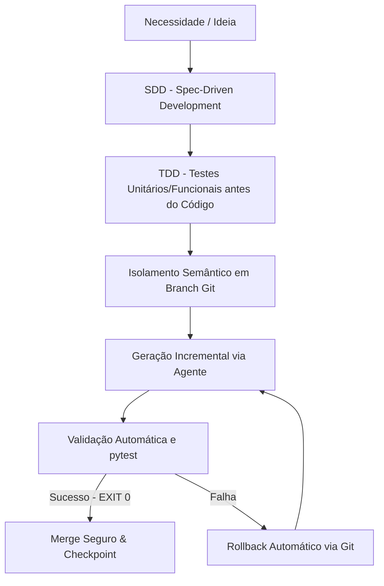

# 🛸 DIRETRIZES DE ENGENHARIA DE SOFTWARE DE IA
## Combate ao "Vibe Coding" e Sistematização do Ecossistema Giulia AI

> **Fonte de Referência:** *2026-05-27 - livro_eng_software.epub*  
> **Status:** **Aprovado & Integrado**  
> **Versão:** v1.0 — 2026-05-27  

---

## 📌 1. A Morte do Vibe Coding & O Imperativo do Processo

A geração acelerada de código por Modelos de Linguagem de Grande Porte (LLMs) cria uma perigosa ilusão de progresso imediato. A ausência de um framework rigoroso de desenvolvimento resulta em **débito técnico invisível**, regressões funcionais e instabilidade sistêmica.

Para evitar esses colapsos na **Giulia AI**, fica instituído o **AI Engineering Paradigm**:



### Regras de Operação no Ecossistema:
1. **Nenhum Código sem SDD (Spec):** É expressamente proibido iniciar qualquer implementação, correção ou refatoração sem que exista um Software Design Document (SDD) que defina a partitura dos requisitos, contratos de API e restrições arquiteturais.
2. **Nenhuma Feature sem TDD (Red-Green-Refactor):** O teste automatizado deve ser escrito antes ou em paralelo à feature. O código de produção é uma consequência da partitura de verificação, garantindo que o comportamento emergente seja rigidamente enquadrado.

---

## 💾 2. Git como Camada Transacional e Reversível (ACID para Código)

Agentes autônomos operam sem histórico intuitivo e com janelas de contexto limitadas. O controle de versão Git deixa de ser uma ferramenta passiva de entrega e passa a ser a **memória histórica e o freio de emergência** do ecossistema.

### Diretrizes de Reversibilidade Sistêmica:
*   **Checkpoints de Pré-Intervenção:** Antes de autorizar qualquer agente a realizar modificações estruturais ou refatorações em arquivos da base, deve ser executado um `commit` atômico.
*   **Rollback Semântico Instantâneo:** Se um teste falhar (`pytest` retornar código diferente de zero) ou se a resposta do agente divergir do SDD, o estado operacional deve ser revertido imediatamente:
    ```bash
    git restore . && git clean -fd
    ```
*   **Isolamento por Branches Semânticas:** Cada atividade no backlog do Jira deve ser desenvolvida em uma `branch` isolada para garantir o isolamento físico das modificações de múltiplos agentes coexistentes.

---

## 🛠️ 3. Padrões POO e Controle Preventivo de Débito Técnico

Como a IA pode gerar centenas de linhas de código em segundos, a desorganização modular pode se propagar de forma exponencial. A **Programação Orientada a Objetos (POO)** e os **Design Patterns clássicos** são as âncoras contra a entropia gerada por LLMs.

### Padrões Obrigatórios na Escrita de Componentes:
1. **Encapsulamento Rígido:** Dados internos de controle e estados voláteis de agentes não devem ser expostos diretamente. Utilize interfaces bem-definidas (Getters/Setters e propriedades controladas).
2. **Uso de Interfaces e Classes Abstratas:** Garanta que novas "Skills" herdem contratos comuns, implementando polimorfismo. Isso permite trocar o motor cognitivo subjacente (ex: trocar Ollama por Gemini) sem quebrar o ecossistema.
3. **Padrões Estruturais Estabelecidos:**
    *   **Factory Method:** Para instanciar diferentes LLMs e coleções do ChromaDB dinamicamente.
    *   **Observer:** Para auditorias e sistemas de observabilidade de pipelines RAG em tempo real.
    *   **Repository:** Para o encapsulamento e abstração de consultas a vetores de banco de dados.

---

## 🧬 4. Agent Skills vs. MCP (Model Context Protocol)

O ecossistema Giulia AI passa a separar formalmente o **Poder Interno (Agent Skills)** do **Poder Externo (MCP)**, garantindo uma arquitetura limpa e de alta extensibilidade:

```
┌─────────────────────────────────────────────────────────────────────────┐
│                       GIULIA AI OPERATING SYSTEM                        │
│                                                                         │
│  ┌───────────────────────────────┐     ┌─────────────────────────────┐  │
│  │   AGENT SKILLS (Poder Interno)│     │   MCP TOOLS (Poder Externo) │  │
│  │  - Contextos Cognitivos       │     │  - Integração de APIs       │  │
│  │  - Regras de Ativação         │ ──> │  - Acesso ao Filesystem     │  │
│  │  - Hooks Pré/Pós Execução     │     │  - Conectores de Bancos     │  │
│  │  - Isolamento (.venv)         │     │  - Serviços Externos        │  │
│  └───────────────────────────────┘     └─────────────────────────────┘  │
└─────────────────────────────────────────────────────────────────────────┘
```

### Arquitetura de uma Agent Skill Padrão:
Cada habilidade autônoma implementada no ecossistema deve residir em um diretório encapsulado sob `skills/` seguindo a estrutura:
*   `SKILL.md`: O manifesto de comportamento e diretrizes semânticas interpretadas pelo agente.
*   `scripts/`: Arquivos Python com a lógica computacional, rodando sob seu próprio ambiente virtual isolado (`.venv`).
*   `tests/`: Testes unitários focados nas capacidades intrínsecas da habilidade.

---

## 📈 5. RAG Estruturado com Provimento de Autoria e Histórico

A base de conhecimento vetorial (**ChromaDB**) deve integrar rastreabilidade de autoria em seus metadados de chunk para permitir auditoria.

### Estrutura de Metadados de Chunks Ingeridos:
```json
{
  "source_document": "MCP - Final Branca.pdf",
  "hash_sha256": "94d3c1eeee1fb6dc",
  "author_type": "AI-Generated / Human-Verified",
  "processing_llm": "gemini-flash-latest",
  "timestamp": "2026-05-27T22:32:00Z"
}
```

Essa rastreabilidade previne o fenômeno de *"Model Collapse"* (onde a IA treina sobre dados gerados por ela mesma sem discernimento de autoria) e garante que o histórico de commits do Git sirva de contexto direto para novos prompts de refatoração aumentados por RAG.
